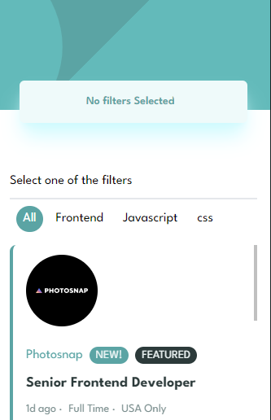

# Frontend Mentor - Job listings with filtering solution

This is a solution to the [Job listings with filtering challenge on Frontend Mentor](https://www.frontendmentor.io/challenges/job-listings-with-filtering-ivstIPCt). Frontend Mentor challenges help you improve your coding skills by building realistic projects.

## Table of contents

- [Overview](#overview)
  - [The challenge](#the-challenge)
  - [Screenshot](#screenshot)
  - [Links](#links)
- [My process](#my-process)
  - [Built with](#built-with)
  - [What I learned](#what-i-learned)
  - [Continued development](#continued-development)
  - [Useful resources](#useful-resources)
- [Author](#author)
- [Acknowledgments](#acknowledgments)

## Overview

### The challenge

Users should be able to:

- View the optimal layout for the site depending on their device's screen size
- See hover states for all interactive elements on the page
- Filter job listings based on the categories

### Screenshot



### Links

- Solution URL: [Add solution URL here](https://github.com/Rickyngechu/simple-filters)
- Live Site URL: [Add live site URL here](https://simple-filters.vercel.app/)

## My process

### Built with

- Tailwind css
- React js
- React router
- [React](https://reactjs.org/) - JS library
- [Tailwindcss](https://tailwindcss.com/) - Tailwind css
- [React Router](https://reactrouter.com/) - React router

### What I learned

Expirience in using react router with the userSearchParams hook for filtering.

```js
const [searchParams, setSearchParams] = useSearchParams();
```

### Continued development

More filtering capabilities to be added with darkmode capability.

## Author

- Website - [Erick ngechu](https://rickyportf.netlify.app/)
- Frontend Mentor - [@yourusername](https://www.frontendmentor.io/profile/Rickyngechu)
- Twitter - [@simplyr_extreme](https://www.twitter.com/yourusername)
